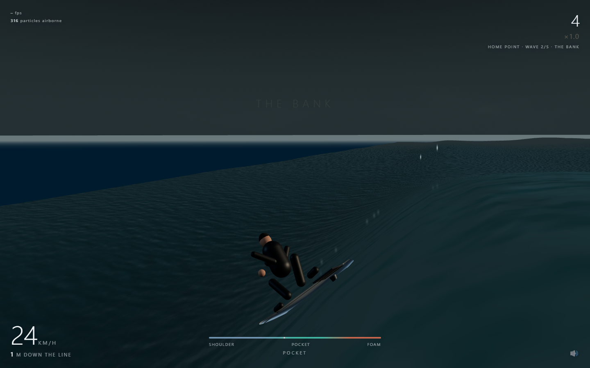
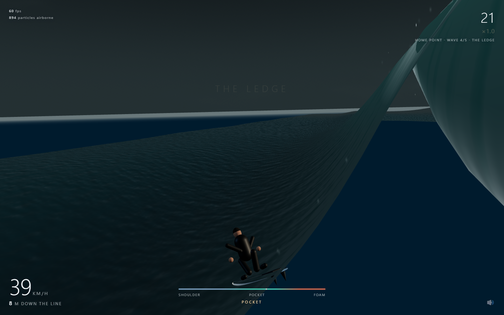

# SURF

**▶ Play: https://kylefriesmarketing.github.io/surf/**

Ride a real breaking wave. Five waves to a set, each bigger than the last. Hold the
pocket, get barrelled, and try not to let the whitewater land on your head.



The water is a solved surface, not an animation: the ocean mesh is displaced every
frame by the same function the board is riding, and the spray is ~11,000 real
particles with gravity, drag and collision against that surface.



**This file is the milestone authority. Read it before the code.**

```bash
C:\Users\kylef\tools\node\node.exe surf/serve.mjs 8477     # then http://localhost:8477
```
```bash
C:\Users\kylef\tools\node\node.exe test-sim.mjs
```

## Deploy

This folder **is** the repo (`kylefriesmarketing/surf`), Pages serves `main` at root,
so there is no copy step and no hardcoded file list to forget:

```bash
git push origin main
```

`.nojekyll` is committed and is load-bearing — without it Pages runs the tree through
Jekyll and `lib/` is at risk. Everything is static ES modules over an importmap, so
Pages needs no build.

⚠️ `__surfShot` cannot reach the shot receiver from the deployed site: the page is
https and the receiver is plain http on :8399, so the browser blocks it as mixed
content. Capture from the local server, verify the live build by reading its DOM and
`__surf()` state.

---

## Status — M3 3D REALISM PASS (2026-08-12)

111/111 headless tests green, 0 GL errors, and 0 console errors. The current frame is a full
3D scene: ~54k triangles, a solved deforming ocean, an independent overhanging curl,
soft-shadowed rider and board, physical spray, and a procedural atmospheric sky.

| System | State |
|---|---|
| Wave field (soliton, peeling point break) | done, 30 tests |
| Rider (constrained-surface dynamics, rails, pump, air) | done, 30 tests |
| Particles (mist / drops / surface foam, real solver) | done |
| **3D ocean + overhanging curl, backlit face, atmospheric sky** | **M3** |
| **The set — 5 escalating waves, session scoring** | **M2, 17 tests** |
| **Manoeuvre detection (5 named tricks)** | **M2, 6 tests** |
| **Water-level chase + readable barrel camera** | **M3** |
| Camera, HUD, scoring, wipeout, game over, restart | done |
| Audio (WebAudio synth, no files) | done, **not yet heard by a human** |
| Touch controls | written, **untested on a real device** |

**Not done / next:** paddling out / wave selection (waves are handed to you in
order), a real wipeout animation, tuning the audio by ear, mobile testing,
deployment to GitHub Pages.

### M6 — the lineup, the paddle-in, and the per-medium ledger (2026-08-12)
Waves are no longer handed to you in order. Before every wave THE LINEUP offers
three characters of the next section — THE INSIDE (A ×0.88, scores ×0.9), THE SET
WAVE (as designed), THE BOMB (A ×1.13, scores ×1.25) — and the choice is the
gameplay: the multiplier prices the risk, the size IS the risk.
`lineup: the bomb is still a wave` pins the worst case (every break's biggest
wave ×1.13) as survivable-but-punishing, because oversized amplitude is exactly
how the risk gradient collapses (the M2 finding).

Every wave now opens with a ~1.3 s paddle-in: prone on the deck, arms
windmilling, gliding in as the section stands up, control at the pop-up.
⚠️ Scripted, not simulated — and the glide targets track `takeoffSpot(t)` LIVE,
because the wave moves ~15 m during the paddle and a start point captured at
wave-start hands you over into the foam. Distance counts from the pop-up.

RECORDS gains a per-medium ledger: each element buckets its own waves, distance,
barrel time, best set and top speed (`recordHeat` takes an `elementId`, defaults
water, heals pre-M4 saves in place). The rival now wears a rust-red kit via
`rig.setAccent()`, and `rig.paddle(phase)` windmills the arms during the paddle.

### M5 — the rival is on your wave (2026-08-12)
Contests are no longer judged against an offline simulation: the rival is a second
full rider (same `board.js`, same 120 Hz steps, same scoring rules, own trick
detector) driven by `ai.js`, visible on your wave on a dark board, throwing its own
rail spray. Their wave ends when they wipe, when the point runs out, or when your
wave does; skill scales their banked score so the ladder ramps. Seeded per wave, so
a rematch replays the same rival ride against a better you. `stepRivalOne()` in
game.js is the whole thing; the old `simulateRival` is deleted.

⚠️ `SprayFX.wake()` has a SHARED accumulator — a second caller halves everyone's
wake. `rail()` is per-call probabilistic and safe to call for any number of riders.
That is why the rival gets rail spray but no wake.

Wipeouts also play out now: the rig tumbles with a random spin, churns the surface
and sinks into the foam, and the score card waits 1.5 s (0.4 s on a clean end)
instead of snatching the screen at the moment of impact.

Audio is element-voiced: the same four noise beds, per-medium multipliers
(`EL_PROFILES` in sfx.js) — lava is a low rumble with almost no wind, snow is
nearly all wind, cosmic is quiet and far away. Still never heard by a human.

### M4 — the elements (2026-08-12)
Five media in `elements.js`, picked on the free-surf screen and unlocked on the
star ladder: **WATER · LAVA (6★) · SAND (2★) · SNOW (4★) · COSMIC (9★)**. An
element is not a reskin — each moves real physics (drag, grip, gravity, pace,
foam grace), and the identity assertions in `elements: every medium is rideable`
pin the differences: snow is the fastest, lava the slowest, cosmic hangs in the
air longest. The tour and contests deliberately stay on water — objectives and
rival scores were tuned there, and a low-gravity cosmic heat would trivialise
every air goal.

⚠️ **A heavy medium must slow the CHASE, not just the rider.** Lava caps the board
at ~15 m/s and the later waves peel at 13–16, so lava and sand shipped their first
draft unrideable on 6 of 8 probed break waves — the best possible line was outrun
by its own wave in 5–21 s. `paceScale` on the element scales the break's peel
speed; the outer-bank rule (sustainable trim speed sets the peel ceiling) applies
per medium.

⚠️ **THREE.js COPIES a Color passed to a material constructor** — it does not keep
the reference. The whole element retint works by mutating the shared `PAL` colour
instances (ocean, curl and sky all hold the same objects in their uniforms), and
the one material that broke this rule was the horizon backdrop plane: it kept its
construction-time copy and drew an ocean-blue band across the lava world. Fixed by
assigning `ocean.far.material.color = PAL.deep` after construction. If a new
material should follow the palette, share the instance explicitly.

### M2 — the set
Five waves, each bigger and faster-peeling than the last (`SET` in `wave.js`,
applied by `setWave()` which mutates `WAVE` in place). Score accumulates across the
whole set, so a wave you survive beats a wave you don't. `R` takes the next wave;
after the fifth you get a per-wave breakdown and the set total, which is what
persists as the best score.

⚠️ **Amplitude alone cannot escalate a wave.** A bigger wave has a more powerful
shoulder, so past about `A = 5` a greedy line stops being punished and the risk
gradient collapses — measured, two tests fail. Peel speed rises with amplitude in
every preset to keep the chase honest, and `set: every wave in the set is rideable`
is the test that says whether a new preset is a wave or a cutscene.

⚠️ FIRST LIGHT barrels barely at all and that is **deliberate** — it is the warm-up.
Steepening its face was swept across four values and moved tube time by 0.2 s; the
limit is the height a rider settles at on a small wave, not the face angle.

### M2 — manoeuvres
`tricks.js`, pure, tested headlessly. Nothing is a button press — every manoeuvre is
recognised from what the board actually did:

| | recognised from |
|---|---|
| **BOTTOM TURN** | time spent low on the face, then climbing with the rails loose |
| **OFF THE LIP** | up near the crest, then back down hard enough to break traction |
| **CUTBACK** | out ahead of the break, heading swung >1 rad inside 1.2 s, sliding |
| **AIR / AIR REVERSE** | λ collapsed and you left the water; rotation picks the name |
| **TUBE RIDE** | scored by duration, not as a one-shot |

There are two distinct scoring routes and they do not overlap: a deep tube line
scores barrel time and does almost no turns, a high aggressive line scores
manoeuvres and rarely gets barrelled. Verified both ways in-game.

---

## The one idea the whole game rests on

A surfer trimming across a wave face stays at roughly constant height, so **gravity
does no net work on them** — and yet they accelerate. The energy comes from the
water surface *moving underneath them*: a moving constraint does work through its
normal force.

Model the wave as a static ramp and you get a rider who slides into the trough once
and stalls forever. That is exactly what the first pass did (max speed 7 m/s, could
not stay with the wave). `wave.surfaceAccel()` solves the constrained-body problem
properly:

```
λ = (g + C) / (1 + hx² + hz²)
C = hxx·ẋ² + 2·hxz·ẋż + hzz·ż² + 2·hxt·ẋ + 2·hzt·ż + htt
ẍ = -λ·hx        z̈ = -λ·hz
```

The `htt` and `h_t` terms are the wave shoving you. On a still surface C vanishes and
it reduces exactly to gravity on the tangent plane — a good check if you refactor it.

**λ is also the launch test, for free.** It is how hard the water presses back to
keep you on the surface, and water cannot pull. λ ≤ 0 means the surface dropped away
and you are airborne. That is what going over the lip is. No threshold hack.

There is a test for this (`rider: the moving surface is what does the work`) which
freezes the wave in time and asserts the ride dies. If someone "simplifies"
surfaceAccel back to a tangent-plane projection, that test is what catches it.

---

## Architecture

| File | What | Pure? |
|---|---|---|
| `wave.js` | the wave field: height, normal, surfaceAccel, water velocity, foam, barrel | **yes** — no THREE, no DOM, no Math.random |
| `board.js` | the rider: rails, drag, pump, air, wipeouts | **yes** |
| `particles.js` | pooled particle solver + the emitters | view (Math.random fine) |
| `render.js` | ocean grid, curl ribbon, sky, board+rider rig, lights | view |
| `game.js` | loop, input, camera, scoring, HUD, debug handles | view |
| `sfx.js` | all audio, WebAudio synthesis, no files | view |
| `test-sim.mjs` | 111 headless tests across physics, breaks, AI, tricks, and tour | — |

`wave.js` and `board.js` import nothing from THREE, which is why the entire ride can
be simulated in node. **Run `node test-sim.mjs` after every change to either.**

### Frame of reference (get this wrong and nothing makes sense)
- **+X** = along-shore. You ride +X, chasing the peel. Foam is behind you (−X).
- **+Z** = out to sea. The wave marches shoreward, toward −Z. The face points −Z.
- **Y** = up, still water at 0.
- `lag = breakX(t) − x`: **negative = out on the shoulder, ~0..8 = the pocket and the
  tube, large positive = the whitewater has you.** Nearly every tuning decision in the
  game is expressed in lag.

### The wave is drawn by the same function it is ridden on
`render.js` displaces ~19k vertices per frame by calling `wave.height()` — the exact
function `board.js` integrates against. That costs a couple of ms and it buys the
guarantee that **there is no second copy of the wave in GLSL that can drift out of
sync with the physics.** Do not "optimise" this into a vertex shader.

The grid is built in wave-aligned coordinates (each column's z samples are centred on
`crestZ(x)`) so the sheet hugs the tilted crest line all the way along the point.

---

## ⚠️ Traps — every one of these cost real time

1. **`-x ** 2` is a syntax error in JS.** It bit twice, in two different files, and
   the second time the browser console still showed the *first* error. Write
   `-(x ** 2)`.

2. **The console buffer retains errors across navigations.** A stale
   "Unary operator…" error survived three reloads after the fix and sent me hunting a
   ghost. Verify with a live `window.onerror` hook installed in the same eval, never
   from the buffer.

3. **The Browser pane never composites this page.** `canvas.width` reports 0, rAF is
   suspended, and screenshot tools return blank. Two consequences:
   - Drive frames by hand with **`__surfStep(n, dt, input)`**. Anything that must
     appear in a captured frame belongs inside `frame()`, not inside `loop()`.
   - Photograph the page from inside itself with **`__surfShot(name, w, h, camFn)`**:
     a WebGL drawing buffer is only cleared on composite, so `render()` then
     `toDataURL()` *in the same synchronous task* returns real pixels. It POSTs to
     `tools-shot-receiver.mjs` on :8399 (repo root). Never pipe base64 through a tool
     result.

4. **`gl_PointSize` is in PIXELS.** `aSize` is world metres and `uScale` must be
   `viewportHeight / (2·tan(fov/2))` — see `SprayFX.setViewport`, called every frame
   because the FOV breathes with speed. The first build hardcoded a guess and drew
   single mist puffs ~6000 px across, which read as a blown-out sun.

5. **Surface-locked foam sprites get clipped in half by the depth test.** A 1.6 m
   sprite floating 0.09 m above the water has its lower half underwater, so the field
   renders as repeated hard half-discs. Float them clear (`buoy 0.38`) and keep them
   faint.

6. **The grid-density function must be measured, not trusted.** The first `axis()`
   blended a uniform sweep with a concentrated one and was neither: it clipped the
   range to a third of what was asked for and put the fine sampling 13 m from the
   target — behind the crest instead of on the face — so the wave rendered as a few
   huge facets. Print the resulting gaps across the face before believing any change.

7. **The barrel must sit in FRONT of the whitewater ramp.** An early `foamAt` started
   the foam at `lag = −1.5`, which put the barrel window inside the foam and made
   getting tubed identical to being eaten. The tube is the last few metres of clean
   water before the wave collapses.

8. **The barrel volume must be centred where a rider actually is.** The first
   `barrelAt` required `y > −0.9`, but the face bottoms out around −0.9, so the tube
   was literally unreachable and scored 0.0 s forever. Verify against a traced ride,
   not against intuition about height.

9. **The curl ribbon has to be a SHORT section.** A generous throw ramp built a
   continuous 46 m white curtain standing at the crest which, from the rider's own
   camera, fills the entire screen and hides the wave. It is now a gaussian centred
   on the same window as `wave.barrelAt`, so the tube you see and the tube you score
   are the same tube.

10. **Sun seaward, camera shoreward.** The face points shoreward, so this is the only
    arrangement that gives the translucent backlit glow — the single most recognisable
    thing about a photographed wave. Sun behind the camera renders the wave as a black
    ridge (tried). Sun on the same side as the face lights it flatly (tried).

11. **A grip-limit test must hold speed constant.** Comparing a hard carve to a gentle
    one across two free rides measures the wrong thing: the hard carve spins out, goes
    slow, and a slow board cannot generate enough lateral demand to slide at all — so
    it reported hard carves as grippier than gentle ones. Seed the probe with velocity
    aligned to heading **and in the water's frame**, or a standing sideslip pins the
    rails past their limit on frame one.

12. **Wave amplitude is load-bearing on the risk gradient.** `A = 5.2` was tried: the
    shoulder gets powerful enough that a greedy line stops being punished, two tests
    fail, and the whole risk/reward structure collapses. 4.40 is the ceiling.

13. **Other chats hold the dev-server slots and the ports.** 8466 was already another
    project. `preview_start` capped out at 5 servers owned by other sessions; running
    `serve.mjs` in a background shell and pointing `preview_start {url}` at it works.

14. **⚠️ THE FLOATER WAS CUT, AND SHOULD STAY CUT** unless the mechanic changes. It
    was implemented three ways and all three were *unreachable*: gating on the
    feathering crest fails because a rider placed at the top of the face immediately
    slides back down it (correct physics — verified by placing one there); gating on
    deep whitewater fails because the drag ends the run before any hold duration
    completes; gating on foam + height fails because nine swept controller variants
    all converged to lag 0 with foam 0. **You cannot voluntarily park behind the
    break in this model — you are spat out or eaten.** It would have scored zero
    forever and nobody would have found out. Reviving it needs a way to survive
    behind the break (a pump-out, a longer grace, a speed reserve), not a looser
    threshold. The reasoning is repeated at the cut site in `tricks.js`.

15. **A trick that fires headlessly can still look broken in game, because of the
    LINE, not the wiring.** Zero manoeuvres fired during a tube-focused run and it
    looked like a bug; replaying the exact controller from the passing test fired
    three. Deep tube lines genuinely do not do turns. Check parity with the test's
    own input before hunting for a wiring fault.

16. **`bash` heredocs and `${...}` mangle patch scripts** (the workspace bible warns
    about this and it still cost two rounds — once corrupting `test-sim.mjs` so badly
    that the `ok()` helper swallowed a whole test group and the suite reported
    60/60 while silently skipping it). Write patch content with the Write tool. If a
    script must locate an insertion point, use `lastIndexOf`, not `indexOf` — the
    first `console.log(` in the test file lives *inside* the assertion helper.

---

## Debug handles

```js
__surf()                       // { t, rider, run, session, trickState, fx, ocean, curl, renderer, … }
__surfStep(n, dt, input)       // drive n frames by hand; input null = read the keyboard
__surfAuto(wantLag)            // the cascade autopilot the tests fly (see below)
__surfWave(i)                  // jump straight to wave i of the set
__surfShot(name, w, h, camFn)  // photograph the page → :8399 → a PNG you can Read
__surfRestart()                // next wave if one is waiting, else a fresh set
```

**The autopilot is the real proof the physics works.** `__surfAuto(wantLag)` is a
two-stage cascade: lag error picks a target height on the face, which picks a heading.
Low on the face is steep and fast; high is flat and slow. That single coupling is the
entire control problem of surfing, and a ~6-line controller can fly the wave with it.

Measured risk gradient (60 s, `test-sim.mjs`):

| line | outcome |
|---|---|
| `wantLag 7.5` — greedy | eaten by the foam at ~17 s, 165 m |
| `wantLag 5.5` — the tube line | survives on a ~2 m ridge, 36 s barrelled |
| `wantLag 0` — the pocket | 60 s, 420 m, no tube |
| `wantLag −14` — safe | 60 s, 437 m, never barrelled, dull |

If those four ever collapse into each other, there is no game left.

---

## Scoring

Speed × pocket-proximity, continuously. The tube is worth ~130/s plus a lump on exit,
and it builds the combo multiplier (cap ×8). Slides score while the rails are actually
broken loose. Airs score on landing, scaled by rotation. Run ends on wipeout — foam,
pearl, or a blown landing — or when the point runs out at 900 m. Best score persists in
`localStorage['surf-best']`.

---

## Controls

`A`/`D` carve · `SPACE` pump (time it on the drop; it pays nothing on the flats) ·
`SHIFT` tuck for extra rail grip · `R` paddle back out · `M` mute.
Touch: left/right half carves, second finger pumps — **written, never tested on a device.**
